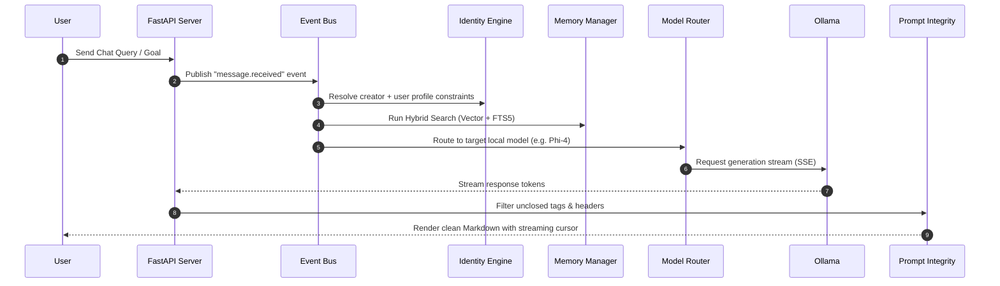
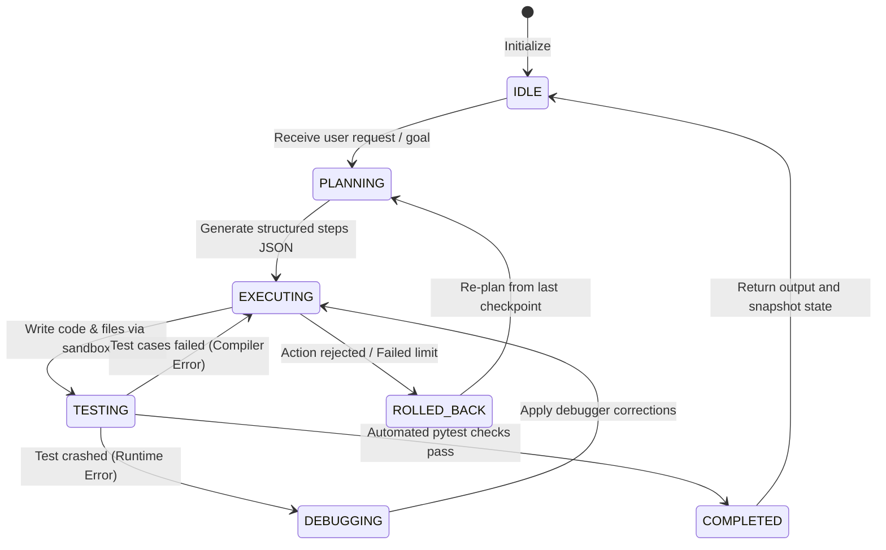

# ALOY — Advanced Local-First Agentic Operating System

> A fully offline, microkernel-based AI companion, software engineering partner, and autonomous multi-agent grid runtime designed to run completely on your device.

<p align="center">
  <a href="https://www.python.org/downloads/release/python-3110/"></a>
  <a href="https://fastapi.tiangolo.com/"></a>
  <a href="https://www.sqlite.org/index.html"></a>
  <a href="https://ollama.com/"></a>
  <a href="LICENSE"></a>
  
  
  
</p>

---

## 📖 Table of Contents

1. [Overview](#-overview)
2. [Why ALOY?](#-why-aloy)
3. [Key Features](#-key-features)
4. [System Architecture](#-system-architecture)
5. [Technology Stack](#-technology-stack)
6. [Installation](#-installation)
7. [First Run Guide](#-first-run-guide)
8. [Model Routing](#-model-routing)
9. [Project Structure](#-project-structure)
10. [Performance & Security](#-performance--security)
11. [Roadmap](#-roadmap)
12. [Bug Reporting & Support](#-bug-reporting--support)
13. [About the Creator](#-about-the-creator)
14. [Acknowledgements](#-acknowledgements)
15. [License](#-license)

---

## 🌟 Overview

**ALOY** is an advanced local-first AI operating system — a fully offline assistant that runs entirely on your own machine. It integrates a persistent event bus microkernel, multi-tier hybrid memory (vector + full-text), a sandboxed tool execution engine, and an autonomous multi-agent grid capable of planning, coding, testing, and debugging software end-to-end.

ALOY does not send your data, conversations, or code to any cloud service. Every inference request is handled locally by [Ollama](https://ollama.com/). Every memory is stored in your local SQLite database. **Zero telemetry. Zero subscriptions. Zero API keys required.**

---

## 🧩 Why ALOY?

| Principle | What It Means for You |
| :--- | :--- |
| **Local-First & Offline** | Models, embeddings, databases, and terminal actions run completely offline on your hardware. No subscriptions or API costs. |
| **Privacy by Design** | Conversations, code, and personal memory stay strictly in your local SQLite databases — never uploaded, never shared. |
| **Autonomous Agent Grid** | ALOY doesn't just generate code. It spawns a multi-agent FSM that writes scripts, creates unit tests, runs them in a sandbox, and autonomously debugs exceptions until they pass. |
| **Decay-Resistant Memory** | Combines vector search and FTS5 keyword indexing with Reciprocal Rank Fusion scoring, background consolidation, and contradiction auditing to maintain context across long sessions. |
| **Prompt Integrity** | Active stream sanitizers and capability filters prevent system prompts and metadata from leaking through to the UI. |

---

## 🚀 Key Features

| Subsystem | Capabilities |
| :--- | :--- |
| **Conversation Engine** | SSE streaming with inline cursor, automatic conversation naming, and branched timeline navigation. |
| **Memory System** | Multi-tier vector + FTS5 search with decay scoring, tag groups, and idle-time contradiction audits. |
| **Reasoning Engine** | Multi-stage thought execution (Draft → Refine → Verify) with real-time reasoning console. |
| **Knowledge Router** | 6-layer progressive query routing (Memory → Workspace → Docs → Web Search) to minimize hallucinations. |
| **Agent Runtime Grid** | Planner, Coder, Tester, Debugger, and Documenter agents with Git state checkpointing and rollback. |
| **Tool Sandbox** | Boundary-checked file editors, terminal shells, Docker controls, and Python runners with explicit confirmation gates. |
| **Premium UI/UX** | Dark, Light, and OLED themes with Outfit/Inter typography, responsive panels, and live hardware telemetry gauges. |

---

## 🏗️ System Architecture

### Request & Response Lifecycle



### Agent Grid FSM Execution



---

## 💻 Technology Stack

| Layer | Technologies |
| :--- | :--- |
| **Frontend** | Vanilla JavaScript (SPA), HTML5, CSS3, FontAwesome 6, Marked.js |
| **Backend** | Python 3.11, FastAPI, Uvicorn (ASGI), Asyncio |
| **Database** | SQLite (WAL mode), `sqlite-vec` (vector search), FTS5 (full-text search) |
| **AI Engine** | Ollama (local model server), `nomic-embed-text` (semantic embeddings) |
| **Testing** | Pytest, Pytest-Asyncio, stress-test suites (233 test cases) |

---

## ⚙️ Installation

### System Requirements

- **OS**: Windows 10 or higher (64-bit)
- **Python**: 3.11 or higher *(developer installation only)*
- **Ollama**: Running locally — [download here](https://ollama.com/)
- **GPU**: NVIDIA GPU with 6+ GB VRAM recommended; CPU-only works with smaller models

### Option 1 — Windows Installer *(Recommended)*

Download the latest release from the [Releases](https://github.com/dhanush708/aloy/releases) page and run:

```
ALOY-Setup-1.0.0.exe
```

ALOY installs to `Program Files\ALOY` with Desktop and Start Menu shortcuts. The application opens automatically in your default browser on first launch.

> [!IMPORTANT]
> [Ollama](https://ollama.com/) must be installed and running before launching ALOY. The startup wizard will guide you through pulling the required models if they are not yet installed.

### Option 2 — Run from Source *(Developers)*

```powershell
# 1. Clone the repository
git clone https://github.com/dhanush708/aloy.git
cd aloy

# 2. Create and activate a virtual environment
python -m venv venv
.\venv\Scripts\Activate.ps1        # Windows PowerShell
# source venv/bin/activate          # macOS / Linux

# 3. Install dependencies
pip install -r requirements.txt

# 4. Launch ALOY
python run.py
```

The server starts on `http://127.0.0.1:8000` and your browser opens automatically.

---

## 🚀 First Run Guide

1. **Install and start Ollama** from [ollama.com](https://ollama.com/).

2. **Pull the required models:**
   ```bash
   ollama pull phi4:latest
   ollama pull qwen2.5-coder:7b
   ollama pull nomic-embed-text:latest
   ```

3. **Launch ALOY** via the installer shortcut or `python run.py`.

4. **Complete the onboarding wizard.** On first launch, ALOY displays a setup overlay where you can enter your name, preferred greeting, and preferences. All data is stored locally — nothing leaves your machine.

> [!NOTE]
> If Ollama is unreachable or required models are missing, ALOY displays a dependency overlay with exact `ollama pull` commands to run. No guesswork required.

---

## 🎯 Model Routing

ALOY maps cognitive tasks to the most appropriate local model to balance quality and VRAM usage:

| Task | Default Model | Context | Min VRAM |
| :--- | :--- | :--- | :--- |
| General Chat & Dialogue | `phi4:latest` | 8K | 6 GB |
| Step Reasoning & Planning | `phi4:latest` | 8K | 6 GB |
| Agent Coding & Execution | `qwen2.5-coder:7b` | 16K | 8 GB |
| Task Planning & Architecture | `qwen2.5-coder:7b` | 16K | 8 GB |
| Semantic Vector Embeddings | `nomic-embed-text` | 2K | 1 GB |

Model assignments are fully configurable via `config/models.yaml`.

---

## 📂 Project Structure

```
aloy/
├── agent/          # Multi-agent FSM grid runtime, metrics, lock manager
├── api/            # FastAPI route groups (Conversation, Agent, Telemetry, Profile)
├── config/         # YAML configs for system prompts, models, and fallback chains
├── conversation/   # SSE streaming adapters, Markdown parser, conversation templates
├── database/       # SQLite connection pool, migration registry, schema definitions
├── docs/           # Architecture guides, security and identity documentation
├── evolution/      # Self-improvement scanners, prompt optimizers, analyzers
├── identity/       # Creator metadata, profile engine, prompt integrity filters
├── installer/      # PyInstaller spec and Inno Setup script for Windows packaging
├── kernel/         # Async event bus, boot loader, service registry, prompt registry
├── knowledge/      # Progressive query router, DDG crawler, documentation cache
├── memory/         # Episodic/semantic memory store, RRF scoring, decay management
├── models/         # Ollama client, model router, performance tracker, fallback chains
├── security/       # Confirmation workflow, capability checks, authorization gates
├── static/         # SPA frontend (index.html, app.js, style.css)
├── tests/          # Pytest suite — unit, integration, stress, and performance tests
├── tools/          # Tool registry, sandbox executors (file, terminal, git, docker)
├── run.py          # Application entry point (browser auto-launch + Uvicorn server)
└── requirements.txt
```

---

## ⚡ Performance & Security

### Performance

- **Hybrid Search**: Combines FTS5 keyword indexing and vector embeddings with Reciprocal Rank Fusion scoring:

$$\text{RRF Score} = \frac{1}{60 + \text{Rank}_{\text{FTS}}} + \frac{1}{60 + \text{Rank}_{\text{Vector}}}$$

- **Async Connection Pool**: WAL-mode SQLite pool with distinct read/write transaction limits — zero database lock errors under concurrent load.
- **Test Coverage**: 233 collected pytest cases covering unit, integration, stress, and agent FSM execution scenarios.

### Security

- **Boundary-Checked Tools**: All file paths are resolved to absolute paths. Any tool attempting to access files outside the workspace raises a violation error.
- **Explicit Authorization Gates**: High-risk operations (script execution, git, Docker) freeze the event bus and require a UI confirmation click before proceeding.
- **Prompt Injection Defense**: The `PromptIntegrityFilter` scans response streams for leaking XML tags (`<identity>`, `<system>`, `<prompt>`) and strips them across buffer boundaries in real time.

---

## 🗺️ Roadmap

| Version | Timeline | Focus |
| :--- | :--- | :--- |
| **v1.1** | Q3 2026 | Dynamic workspace-defined tool plugins; virtualenv-scoped packaging to reduce installer size |
| **v2.0** | Q1 2027 | Collaborative multi-agent teams with split workspaces and shared state |
| **v3.0** | Q4 2027 | Self-evolution microkernel — autonomously compiles and improves its own backend prompts |

---

## 🐛 Bug Reporting & Support

Found a bug or need help?

1. **Open an issue** on [GitHub Issues](https://github.com/dhanush708/aloy/issues) with a clear description and steps to reproduce.
2. **For private support or commercial licensing**, contact the creator at [anbudhanush31@gmail.com](mailto:anbudhanush31@gmail.com).

When reporting a bug, please include your OS version, ALOY version, and the versions of your Ollama models.

---

## 👤 About the Creator

**ALOY Version 1.0** was designed, architected, engineered, implemented, tested, documented, packaged, and released end-to-end by **Dhanush A.** as an independent software engineering project.

| | |
|---|---|
| **Creator** | Dhanush A. |
| **GitHub** | [github.com/dhanush708](https://github.com/dhanush708) |
| **Contact** | [anbudhanush31@gmail.com](mailto:anbudhanush31@gmail.com) |

*All core libraries, event-driven components, FSM grid orchestrators, knowledge routers, telemetry systems, and documentation remain the intellectual property of the creator.*

---

## 🤝 Acknowledgements

ALOY is built on the shoulders of the open-source community. Thanks to the creators and maintainers of:

- [Python](https://www.python.org/) — Core runtime
- [FastAPI](https://fastapi.tiangolo.com/) — Web server infrastructure
- [Ollama](https://ollama.com/) — Local LLM server
- [SQLite](https://www.sqlite.org/) & [sqlite-vec](https://github.com/asg017/sqlite-vec) — Storage and vector search
- [Pytest](https://pytest.org/) & [Pytest-Asyncio](https://github.com/pytest-dev/pytest-asyncio) — Testing framework
- [Marked.js](https://marked.js.org/) — Markdown rendering
- [Mermaid](https://mermaid.js.org/) — Architecture diagrams

---

## 📄 License & Legal

ALOY is proprietary software distributed under a custom **End User License Agreement (EULA)**. Review all legal documents before using the software:

| Document | Link |
|---|---|
| End User License Agreement | [LICENSE](LICENSE) |
| Terms of Use | [TERMS_OF_USE.md](TERMS_OF_USE.md) |
| Privacy Policy | [PRIVACY_POLICY.md](PRIVACY_POLICY.md) |
| Disclaimer | [DISCLAIMER.md](DISCLAIMER.md) |
| Security Policy | [SECURITY.md](SECURITY.md) |
| Third-Party Licenses | [THIRD_PARTY_LICENSES.md](THIRD_PARTY_LICENSES.md) |

**Key terms at a glance:**
- ✅ Personal and non-commercial use is permitted.
- ❌ Redistribution, rebranding, or resale without written permission is prohibited.
- ❌ Commercial sublicensing or selling the Software is strictly prohibited.
- ✅ Creator credits and attribution must remain intact in all copies.
