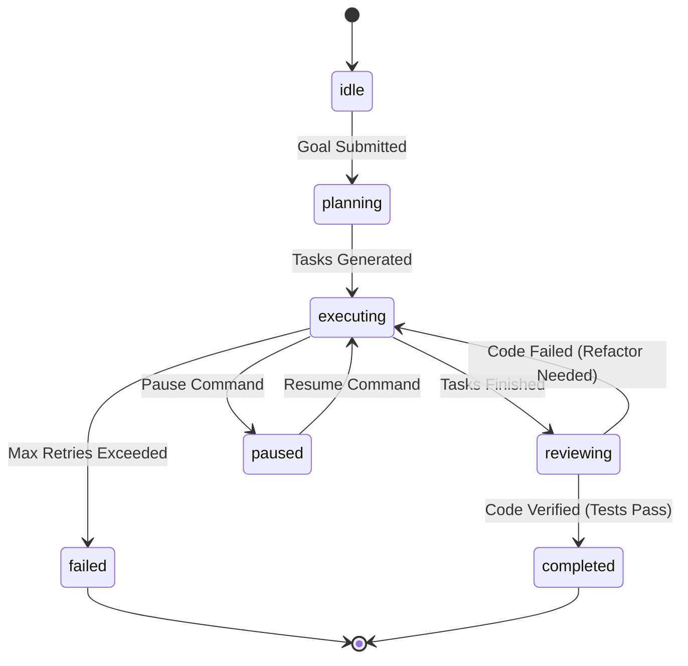

# FSM Agent Grid & Task orchestration — ALOY Version 1.0

The **Agent Grid** is ALOY's autonomous developer runtime. Instead of relying on a single linear chain of LLM calls, ALOY coordinates a state machine composed of specialized agents cooperating to solve software engineering tasks.

---

## 1. Agent Roles in the Grid

The grid contains 9 specialized agents that coordinate to complete goals:
1. **Manager**: Receives the target goal, handles workspace locks, and monitors lifecycle states.
2. **Planner**: Creates detailed implementation checklists and schedules dependencies.
3. **Architect**: Inspects class structures and maps coding dependencies.
4. **Coder**: Edits files, creates new modules, and writes implementations.
5. **Tester**: Writes unit tests (pytest cases) and executes code.
6. **Debugger**: Parses stack traces and fixes runtime exceptions.
7. **Reviewer**: Audits code for syntax errors and logic correctness.
8. **Documenter**: Updates READMEs, inline comments, and changelogs.
9. **Learner**: Extracts consolidated insights and patterns from successful runs.

---

## 2. Finite State Machine (FSM) Lifecycle

The grid operates under a strict FSM. State transitions are verified by the `AgentRuntime` before triggering task steps.

---

## 3. Workspace Snapshots & Surgical Rollbacks

To prevent coding agents from corrupting repository code, the `WorkspaceSnapshotManager` performs backup tracking:
1. **Checkpoint Seeding**: Before a coder or debugger modifies a file, a zip snapshot of the target directory is generated and assigned a unique checkpoint ID.
2. **State Verification**: If a unit test fails or compiles incorrectly, the system can execute a **Surgical Rollback** to restore a single file (or the entire workspace directory) back to a previous checkpoint.
3. **Execution Journal**: All events, file changes, and tool outputs are recorded in a permanent JSONL journal file.

---

*Designed and developed by Dhanush A.*
