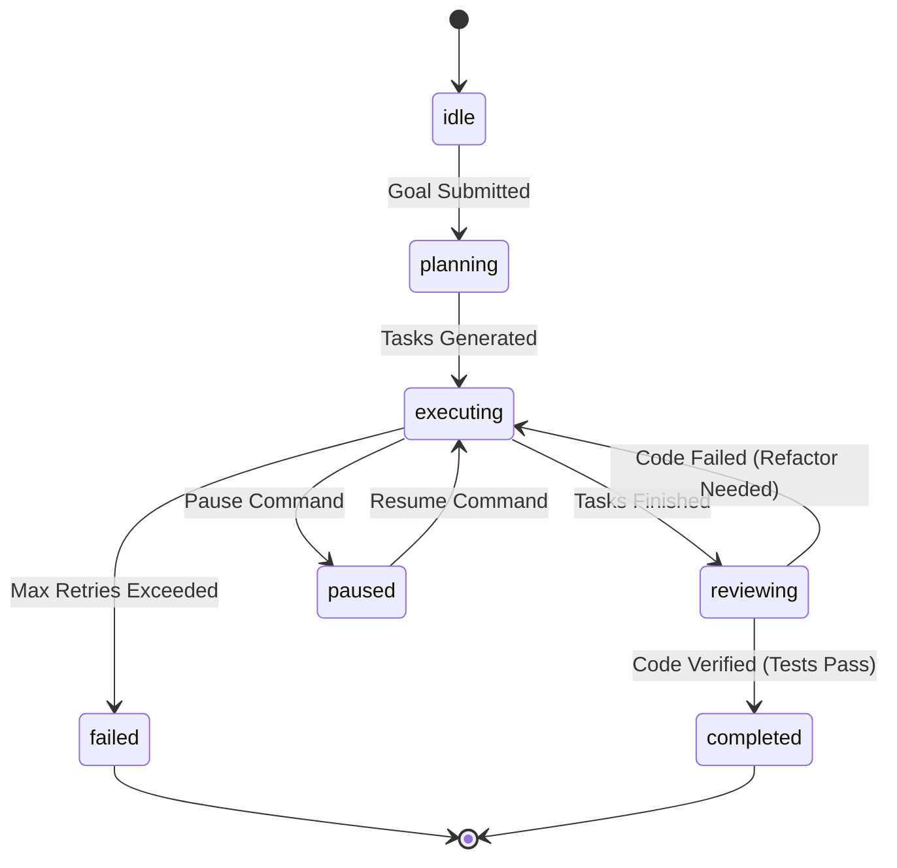

# FSM Agent Grid & Task Orchestration — ALOY Version 1.0

The **Agent Grid** is ALOY's autonomous software development runtime. Instead of executing linear chains of LLM prompts, ALOY coordinates a Finite State Machine (FSM) composed of specialized cooperative agents executing tasks scheduled on a dynamic dependency graph.

---

## 1. Agent Roles in the Grid

The grid contains 9 specialized agents:
1. **Manager**: Coordinates the workflow, handles workspace locks, schedules tasks, and monitors session state.
2. **Planner**: Decomposes the user's high-level goal into concrete task steps with explicit dependencies.
3. **Architect**: Analyzes workspace ASTs, checks files, and maps code dependencies.
4. **Coder**: Edits files, creates new modules, and writes implementations.
5. **Tester**: Generates unit tests (pytest cases) and executes them.
6. **Debugger**: Parses stack traces and resolves runtime exceptions.
7. **Reviewer**: Audits proposed modifications for syntax errors and logical correctness.
8. **Documenter**: Updates READMEs, inline comments, API documentation, and changelogs.
9. **Learner**: Consolidates technical insights from successful runs to prevent future errors.

---

## 2. Finite State Machine (FSM) Lifecycle

The grid operates under a strict FSM. State transitions are verified by the `AgentRuntime` before triggering task steps.

---

## 3. Database-Backed Task Queue

All tasks are stored in the local SQLite database (`agent_tasks` table) and managed via the `AgentTaskQueue`. This design ensures persistence, auditable execution, and the ability to pause and resume sessions.

### Dependency Resolution
Tasks can specify list dependencies (`depends_on`). The task queue resolves the execution graph dynamically:
- A task is considered **runnable** only if its status is `PENDING` and all task IDs listed in its `depends_on` array are in the `DONE` status.
- Runnable tasks are sorted by `priority` ascending (lower values execute first, e.g., Priority `1` plan tasks take precedence) and then by creation timestamp (`created_at`).

### Parallel Scheduler Loop
The `ManagerAgent` runs a non-blocking orchestration loop that polls for runnable tasks:
- **Max Concurrency**: Up to `max_parallel = 4` tasks are executed concurrently using `asyncio.create_task`.
- **Race Condition Prevention**: Tasks are marked as `RUNNING` in the database immediately upon extraction to prevent concurrent execution conflicts.
- **Upstream Failures**: If a task fails and exceeds its `max_retries` threshold, any pending downstream tasks depending on it are marked as `FAILED` with the error `"Unrunnable dependencies due to upstream failure"`.

---

## 4. Cancellation & Progress Tracking

### Cancellation Logic
Sessions can be cancelled at any time:
- The user issues a cancel command, which triggers the runtime to set the `ExecutionContext.cancellation_token` event.
- Active asyncio worker tasks are aborted immediately.
- Pending or running tasks associated with the session are updated to the `CANCELLED` status in the database.
- Workspace locks are released.

### Progress & Dynamic ETA Telemetry
During session execution, the scheduler regularly updates the session's metadata with real-time progress information:
- **Progress Percentage**: Calculated as $\text{pct} = \frac{\text{completed\_tasks}}{\text{total\_tasks}} \times 100$.
- **Dynamic ETA**: The system tracks the execution duration of completed tasks. It computes the average task duration (`avg_dur`, defaulting to 45 seconds if no metrics exist) and dynamically updates the Estimated Time of Arrival:
  $$\text{ETA (seconds)} = \text{remaining\_tasks} \times \text{avg\_duration}$$
- **Telemetry Publishing**: Progress metrics (including current running task, active model, and retry counts) are published to the frontend via Server-Sent Events (SSE) using the Microkernel Event Bus.

---

## 5. Workspace Snapshots & Surgical Rollbacks

To prevent coding agents from corrupting repository code, the `WorkspaceSnapshotManager` performs backup tracking:
1. **Checkpoint Seeding**: Before a coder or debugger modifies a file, a zip snapshot of the target directory is generated and assigned a unique checkpoint ID.
2. **State Verification**: If a unit test fails or compiles incorrectly, the system can execute a **Surgical Rollback** to restore a single file (or the entire workspace directory) back to a previous checkpoint.
3. **Execution Journal**: All events, file changes, and tool outputs are recorded in a permanent JSONL journal file.

---

*Designed and developed by Dhanush A.*
