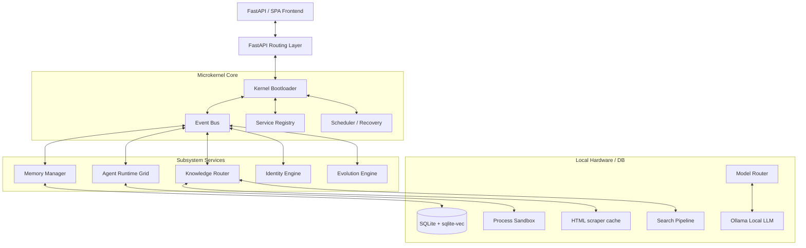

# System Architecture — ALOY Version 1.0

ALOY is built around a private **Event-Driven Microkernel** architecture. All subsystems (Memory, Agent Runtime, Security, Knowledge Router) are decoupled and communicate asynchronously via a central event bus.

---

## 1. High-Level System Architecture

---

## 2. Subsystem Explanations

### Event Bus (`kernel/event_bus.py`)
The event bus acts as the central messaging nervous system. Subsystems subscribe to specific topics (e.g., `message.received`, `tool.executed`, `proposal.created`) and publish events asynchronously. This allows services to run concurrently without blocking main I/O loops.

### Service Registry (`kernel/service_registry.py`)
Ensures dynamic loading of services. At startup, the bootloader registers core managers, allowing them to look up each other without tight circular dependencies.

### Sandbox & Security Sandbox (`security/sandbox.py`, `security/policy.py`)
All high-risk tool operations (filesystem write, command run) are processed through the security layer. The filesystem calls are restricted using workspace boundaries, and actions require a user-confirmed callback event before execution.

### Search Pipeline (`knowledge/search_pipeline.py`)
Integrated into the Knowledge Router. Handles semantic query classification, multi-query rewrites, concurrent DuckDuckGo search execution, fresh source parsing, multi-factor scoring (relevance, freshness, domain credibility, and official source bonus), query broadening retries, and topic drift classification.

---

## 3. Dynamic Model Routing

The `ModelRouter` maps specific conversational, reasoning, or coding tasks to the optimal local model running on Ollama, ensuring performance and compatibility with local hardware configurations.

| Task Category | Primary Local Model | Fallback Model | Purpose |
|:---|:---|:---|:---|
| **Simple Chat** | `qwen3:14b` | `qwen3:14b` | General conversational responses and fast feedback |
| **Complex Chat / Synthesis** | `qwen2.5-coder:14b` | `qwen3:14b` | RAG context synthesis, research answers, and file inspections |
| **Coding Request** | `qwen2.5-coder:14b` | `qwen3:14b` | Source code generation, bug fixing, and script writing |
| **Reasoning Request** | `deepseek-r1:14b` | `qwen3:14b` | Multi-stage logical thinking, task drafting, and verification loops |
| **Classification / Intent** | `qwen3:14b` | `qwen3:14b` | Rapid intent routing and semantic drift detection |
| **Summarization / Memory** | `qwen3:14b` | `qwen3:14b` | History compaction and long-term memory extraction |

---

## 4. Request Lifecycle Data Flow

When a user submits a chat message:
1. The SPA Frontend posts the message to `/api/conversation/{id}/message`.
2. The endpoint registers the call, updates database records, and triggers the `ConversationEngine` pipeline.
3. The context builder aggregates:
   - System prompts from the `IdentityEngine`.
   - Workspace metadata (git branches, project targets) from the `ProjectManager`.
   - Relevant vector memory hits from the `MemoryManager`.
   - Semantic web search results (if real-time information is needed) from the `SearchPipeline`.
4. The constructed prompt payload is sent to the `ModelRouter`.
5. The model router streams token chunks from Ollama.
6. The `PromptIntegrityFilter` filters incoming token chunks in real-time, removing configuration syntax or unclosed XML elements.
7. Clean text tokens are streamed back to the user via Server-Sent Events (SSE).

---

*Designed and developed by Dhanush A.*
