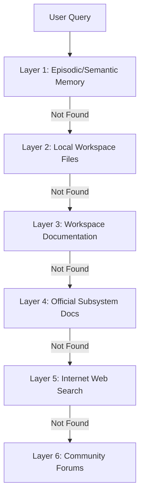

# Knowledge & Research Engine — ALOY Version 1.0

ALOY includes an offline-first **Knowledge & Research Engine** designed to scan directories, parse technical documentation, and route research questions safely.

---

## 1. The 6-Layer Escalation Router

When a user asks a technical or factual question that isn't answered in short-term context, the router escalates through 6 distinct layers:

---

## 2. Ingestion & Version-Aware Summarization

ALOY indexes markdown, HTML, and text documentation inside workspaces:
* **Pruning & Cleaning**: Removes boilerplate, navigation headers, and styling markup.
* **Vector Indexing**: Segments files into logical chunks and indexes them into semantic tables.
* **Version Verification**: Detects version boundaries in library documentation to prevent outdated syntax references (e.g. tracking specific FastAPI or Pydantic v2 changes).

---

## 3. Web Search & Retrieval Cache

When internet research is required (and configured):
* **Internet Router**: Uses Tavily API to fetch high-relevance search links.
* **Content Scraper**: Downloads web page content, parses it to clean text, and ranks it.
* **Persistent Cache**: Scraped research answers are cached in SQLite with a configurable Time-To-Live (TTL) boundary, preventing redundant search requests.

---

*Designed and developed by Dhanush A.*
