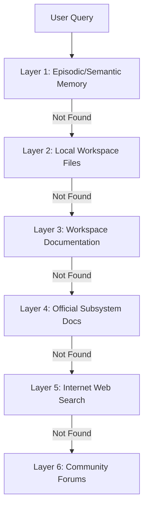

# Knowledge & Research Engine — ALOY Version 1.0

ALOY includes an offline-first **Knowledge & Research Engine** designed to scan workspace directories, parse local documentation, and dynamically route research queries to the local vector index or live search.

---

## 1. The 6-Layer Escalation Router

When a user asks a technical or factual question, the router escalates through 6 distinct layers in order:

If the first four offline layers yield no high-confidence results, the query escalates to the web search layers.

---

## 2. Production-Grade Search Pipeline

The search engine features a production-ready retrieval pipeline:

### A. Semantic Search Gating
Queries are checked against heuristic keyword lists (e.g., year checks, news, weather words) and validated through a fast semantic LLM classifier to determine if live internet data is required. This prevents unnecessary searches on general knowledge or conversational queries.

### B. Query Rewriting
Before executing the search, the original user query is rewritten into 2-3 short, search-optimized variations to maximize search index matches.

### C. Concurrent Multi-Search & Deduplication
The rewritten queries are executed in parallel via non-blocking asynchronous requests (`asyncio.gather`) using the `WebSearchTool` (scraping `html.duckduckgo.com`). The results are merged and deduplicated by URL to ensure a clean source corpus.

### D. Multi-Factor Source Ranker
Retrieved web pages are scored based on four factors to select the top 5 sources:
- **Base Domain Authority**: Domain-specific credibility weightings (0 to 100 points).
- **Freshness**: Up-to-date temporal relevance bonuses.
- **Relevance**: Cosine similarity overlap with the query.
- **Official Source Bonus**: A **+15 points** bonus for official domains (e.g., Python documentation, GitHub source trees, Microsoft/fastapi docs).

### E. Query Broadening Retries
If the search yields 0 results:
- **Retry 1**: Applies a heuristic query broadener (strips filler words, auxiliary verbs, and superlatives).
- **Retry 2**: Queries the local model to generate an extremely broad search query.

---

## 3. Conversation Continuity & Cache

### Short-Term Search Cache
Successful searches are cached in a local SQLite table (`research_cache`) with a configurable **10-minute Time-To-Live (TTL)**. Subsequent identical queries hit the cache immediately, saving network bandwidth and lowering response latency.

### Follow-Up Topic Continuity
When users ask short follow-up questions (e.g., *"Explain that further"*, *"Who scored?"*):
- The **Topic Drift Detector** checks word overlap and queries the local classifier to see if the topic has shifted.
- If it is the same topic, the pipeline reuses the search context from the prior message in the history **without executing a new web search**.
- If the topic has drifted, it triggers a new search.

---

## 4. Synthesis & Hallucination Protection

The ranked sources are passed to the synthesizer:
- **Strict Evidence Matching**: The model must synthesize the response using **only** the facts in the provided web sources.
- **Clickable Citations**: Inline Markdown brackets (e.g., `[TechCrunch](URL)`) are generated pointing directly to the URLs.
- **Failure Recovery**: If the search fails or the sources have insufficient evidence to answer the query, the pipeline returns:
  `"I couldn't verify this information from reliable sources."`
  and avoids any training cutoff date or model limitation statements.

---

*Designed and developed by Dhanush A.*
