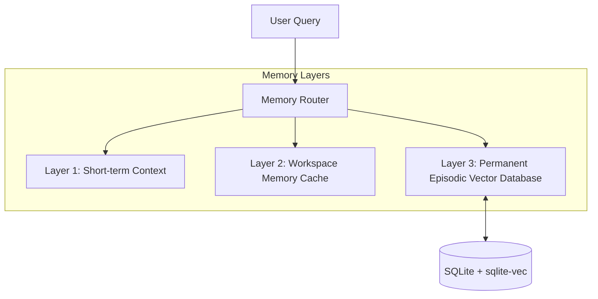

# Episodic & Semantic Memory — ALOY Version 1.0

ALOY features a persistent **Multi-Tier Memory** system designed to prevent context window saturation and retain long-term developer configurations.

---

## 1. Multi-Tier Memory Architecture

### Layer 1: Short-Term Context
Retains the immediate message history (turn-by-turn history of the active conversation). This is loaded directly into the LLM system prompt context window.

### Layer 2: Workspace Cache
Stores local workspace variables, git diff histories, and session configurations. These expire when a conversation session is deleted.

### Layer 3: Permanent Vector Memory
Contains permanent semantic records of Dhanush's profiles, system specifications, preferences, and coding styles. These are permanent and do not decay.

---

## 2. Vector Indexing with `sqlite-vec`

ALOY uses `sqlite-vec` to store and query high-dimensional embeddings locally in SQLite:
* **Embeddings**: Generated using local `nomic-embed-text` via Ollama.
* **Storage**: Coordinates vectors inside an isolated virtual table (`virtual table using vec0`).
* **Querying**: Executes cosine-similarity searches locally in SQLite, retrieving context hits in less than 5 milliseconds.

---

## 3. Consolidation & Contradiction Detection

On idle, a background pipeline consolidates transient workspace events into permanent long-term memory:
1. **Fact Extraction**: Extracts atomic facts from recent conversation histories.
2. **Contradiction Check**: Before saving a new fact, the system queries nearby vectors to detect contradictions.
3. **Merging/Pruning**: If a contradiction is detected, the old fact is either updated or merged (or flagged for user correction), preventing memory duplication.

---

*Designed and developed by Dhanush A.*
