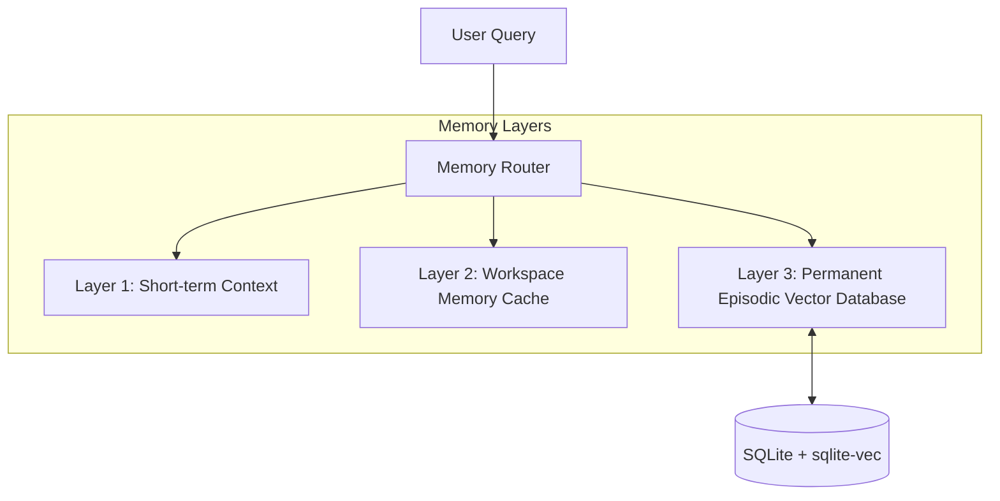

# Episodic & Semantic Memory — ALOY Version 1.0

ALOY features a persistent **Multi-Tier Memory** system designed to prevent context window saturation and retain long-term developer configurations and companion interactions completely offline.

---

## 1. Multi-Tier Memory Architecture

### Layer 1: Short-Term Context
Retains the immediate message history (turn-by-turn history of the active conversation). This is loaded directly into the LLM system prompt context window.

### Layer 2: Workspace Cache
Stores local workspace variables, git diff histories, and session configurations. These expire when a conversation session is deleted.

### Layer 3: Permanent Vector Memory
Contains permanent semantic records of dhanush's profiles, system specifications, preferences, and coding styles. These are permanent and do not decay.

---

## 2. Hybrid Retrieval with Reciprocal Rank Fusion (RRF)

When the Memory Manager queries Permanent Vector Memory, it runs a **Hybrid Retrieval** pipeline combining full-text search (FTS5) and vector search:

1. **FTS5 Match**: Searches text fields locally in SQLite using FTS5 virtual tables to find exact keyword matches.
2. **Vector Match**: Generates high-dimensional vector embeddings using the local `nomic-embed-text` model via Ollama and queries them.
3. **sqlite-vec Integration**: Cosm-similarity/L2 distance search is computed locally in SQLite utilizing virtual tables (`virtual table using vec0`) to retrieve semantic context.
4. **Reciprocal Rank Fusion (RRF) Scoring**: Combines keyword ranks and vector ranks using the RRF algorithm to compute a unified relevancy score:
   $$\text{RRF Score} = \frac{1}{60 + \text{Rank}_{\text{FTS}}} + \frac{1}{60 + \text{Rank}_{\text{Vector}}}$$
5. **Decay, Importance & Recency Scoring**: Recalculates final memory scores by combining RRF, importance metadata, and time recency decay multipliers:
   $$\text{Final Score} = (0.5 \times \text{Normalized RRF}) + (0.25 \times \text{Importance}) + (0.25 \times \text{Recency})$$

---

## 3. Consolidation & Contradiction Detection

On idle, a background pipeline consolidates transient workspace events into permanent long-term memory:
1. **Fact Extraction**: Extracts atomic facts from recent conversation histories.
2. **Contradiction Check**: Before saving a new fact, the system queries nearby vectors to detect contradictions.
3. **Merging/Pruning**: If a contradiction is detected, the old fact is either updated or merged (or flagged for user correction), preventing memory duplication.

---

*Designed and developed by Dhanush A.*
