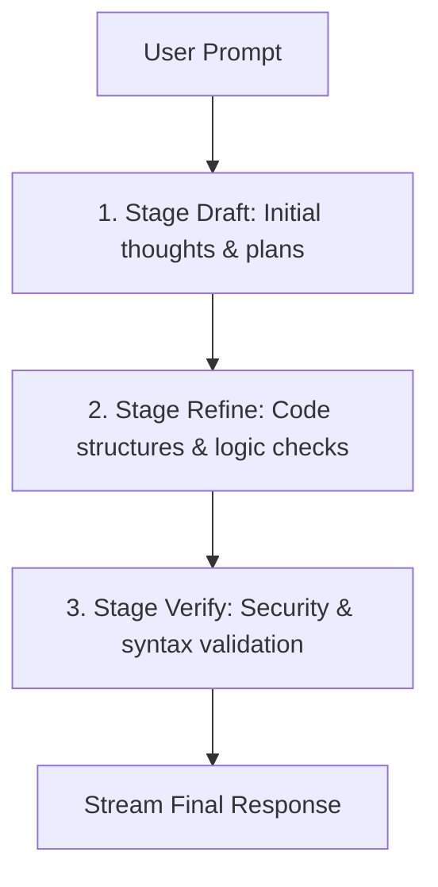

# Multi-Stage Reasoning Engine — ALOY Version 1.0

ALOY implements a dedicated **Multi-Stage Reasoning Engine** that allows local LLMs to "think before they speak." This pipeline forces structural reasoning and verification loops before returning final user responses.

---

## 1. The Reasoning Pipeline Flow

### Stage 1: Draft
The model drafts an initial high-level outline of the task, identifying file dependencies, potential security implications, and libraries to use.

### Stage 2: Refine
The model refines the implementation plan, checking for logic flaws, circular imports, or syntax errors.

### Stage 3: Verify
The model reviews the output against security parameters (verifying that no path traversal or sandbox violation exists) and checks for code completeness.

---

## 2. Real-Time UI Console

During active execution, the reasoning stages are streamed directly to the **Subsystem Live Stats** details panel under "Reasoning Thoughts."
* Thoughts are streamed in real-time as SSE data payloads (`data.type = "reasoning_progress"`).
* This provides visibility into the LLM's plan of action before any text is rendered in the main conversation window.

---

## 3. Streaming and Inline Token Cursors

The output streaming uses standard FastAPI Response streams. To make the interface feel responsive and interactive, an inline cursor (`token-cursor-inline`) is injected into the last block element of the HTML DOM stream, preventing jarring page jumps or wrapping issues.

---

*Designed and developed by Dhanush A.*
